  <!-- Banner Animado Nativo em SVG (Zero dependência externa, 100% estável) -->
  

    

  <!-- Typing SVG animado estilo DenverCoder1 -->
  

    

  <!-- Botões de Contato -->
  

    
    &nbsp;
    
    &nbsp;
    
  

---

### // Sobre Mim

Profissional de Tecnologia com perfil híbrido e foco em resultados práticos, unindo a visão de **Infraestrutura / Suporte de TI** à criação de soluções robustas em **Engenharia de Software Full-Stack**. 

Atualmente atuo na **Pochteca Coremal**, trabalhando tanto na sustentação de ambientes e apoio técnico aos usuários, quanto no desenvolvimento ativo e evolução do ecossistema corporativo interno.

- **Formação Acadêmica:**
  - Cursando **Engenharia da Computação** — *UNIVESP (Universidade Virtual do Estado de São Paulo)*
  - Cursando **Análise e Desenvolvimento de Sistemas (ADS)** — *SENAC*
- **Atuação Profissional:**
  - **Suporte de TI & Desenvolvimento Interno** — *Pochteca Coremal*
  - Suporte N1/N2, administração de redes corporativas, acessos e diagnósticos.
  - Arquitetura e desenvolvimento de aplicações corporativas de ponta a ponta.
- **Diferenciais Técnicos:**
  - Criação de APIs assíncronas de alto desempenho em **Python (FastAPI)** com padrões REST e segurança JWT.
  - Interfaces dinâmicas em **React 18** com componentes modulares, dashboards analíticos e controle granular de permissões (RBAC).
  - Conexão e integração em tempo real de ERP legado (**Oracle 11g/19c via Thick Mode**) com infraestrutura na nuvem (**PostgreSQL / Supabase**).
  - Automação de tarefas corporativas e desenvolvimento ágil utilizando ferramentas avançadas como **Claude Code** e **Google Gemini**.

---

### // Tecnologias & Ferramentas

  

<table width="100%">
  <tr>
    <td width="50%" valign="top">
      <h4>▸ Backend &amp; Dados</h4>
      <ul>
        <li><b>Linguagens:</b> Python, JavaScript (ES6+), SQL</li>
        <li><b>Frameworks:</b> FastAPI, Uvicorn, Pydantic</li>
        <li><b>Bancos de Dados:</b> Oracle 11g/19c (Thick Mode), PostgreSQL, Supabase</li>
        <li><b>Segurança:</b> JWT, RBAC granular, Active Directory / LDAP</li>
      </ul>
    </td>
    <td width="50%" valign="top">
      <h4>▸ Frontend, Infra &amp; Suporte</h4>
      <ul>
        <li><b>Frontend:</b> React 18, Vite, CSS3 Moderno, Framer Motion, Axios</li>
        <li><b>Suporte &amp; Infra:</b> Suporte N1/N2, Redes TCP/IP, Windows Server</li>
        <li><b>Ferramentas:</b> Claude Code, Google Gemini, VS Code, Git, GitHub</li>
        <li><b>Automação:</b> Scripts em PowerShell, Batch e Python</li>
      </ul>
    </td>
  </tr>
</table>

---

### // Projeto em Destaque

<table width="100%">
  <tr>
    <td>
      <h3>🏢 PowerHub — Ecossistema Corporativo (Pochteca Coremal)</h3>
      

        Plataforma corporativa central de inteligência comercial, precificação estratégica, CRM e governança de acessos.
      

      

        
        
        
        
        
      

      <ul>
        <li><b>Arquitetura de Alta Performance:</b> Backend assíncrono com mais de <b>175 endpoints</b> estruturados em FastAPI.</li>
        <li><b>Integração ERP em Tempo Real:</b> Consulta e sincronização contínua com banco <b>Oracle 11g (ERP Coremal)</b> em Thick Mode para clientes, limites de crédito, prazos e produtos.</li>
        <li><b>Camada de Dados na Nuvem:</b> Gerenciamento simultâneo de bases de produção e homologação via <b>Supabase (PostgreSQL)</b>.</li>
        <li><b>Interface Reativa & Governança:</b> Frontend em <b>React 18 + Vite</b> com controle rigoroso de acessos (RBAC por perfil e subtela).</li>
        <li><b>Automação Comercial:</b> Emissão instantânea de relatórios e propostas em PDF (fpdf2 / jsPDF) e planilhas XLSX (SheetJS).</li>
      </ul>
    </td>
  </tr>
</table>

---

### // Estatísticas & Sequência de Atividade

  

---

  Estêvão Bueno &nbsp;•&nbsp; Construído com foco em código limpo, arquitetura escalável e aprendizado contínuo.

